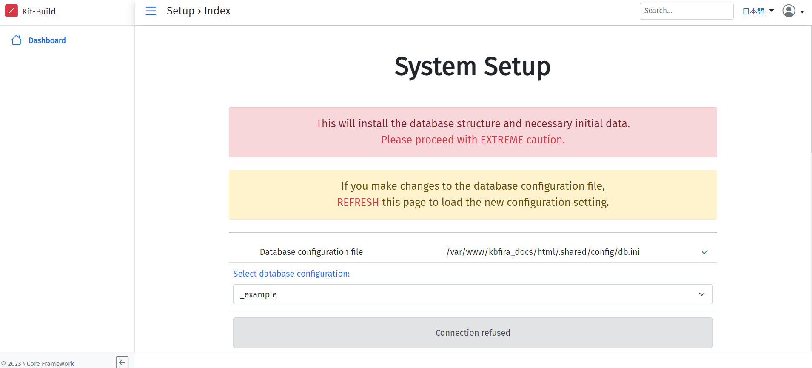
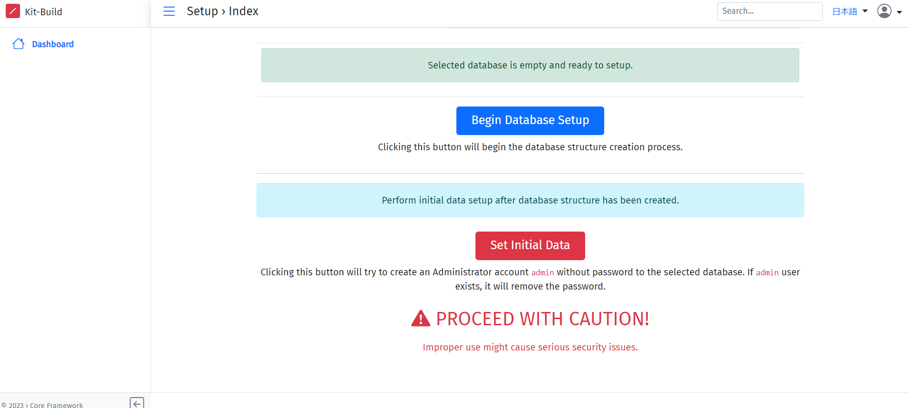

# docker環境構築
1. docker公式よりPCにdockerをダウンロードして下さい  
(Windowsの場合は[Dockerのインストール方法(Windows).md](/Dockerのインストール方法(Windows).md)を参照して下さい)
1. 自分でデスクトップなどにフォルダを1つ作成してください, 名前に指定はありません  
次にVScodeを開き，その作成したフォルダをターミナルに移動して開いてください
1. このリポジトリを以下のコマンドを実行してダウンロードしてください
    ```
    git clone --recursive https://github.com/LearningEngineeringLaboratory/kbfira_setup.git
    ```
1. 続けて以下のコマンドを実行してdockerを立ち上げてください. 以下のコマンドを実行し,kbfira_setup-mainに移動・Dockerを立ち上げて下さい  
    ```  
    cd kbfira_setup
    ```
    ```
    docker-compose up -d
    ```
1. 以下のコマンドより,nginxとmysqlのコンテナが作成されたか確認して下さい
    ```
    docker ps
    ```
    以下のように表示されればOK
    | CONTAINER ID | IMAGE | COMMAND |CREATED|STATUS|PORTS|NAMES|
    |:-------|:--------|:-------|:-------|:--------|:-------|:-------:|
    |...      |kbfira_setup-main-nginx        |"/sbin/my_init"       |...|...|0.0.0.0:8081->80/tcp |nginx-container|
    |...     |mysql:latest         |"docker-entrypoint.s…"      |...|...|33060/tcp, 0.0.0.0:3308->3306/tcp|mysql-container|

1. ブラウザで以下のURLにアクセスして下さい
    http://localhost:8081/kbfira_docs/index.php/admin/m/x/app/setup
    
1. データベースの初期化を行うために,Select databese configuration:のプルダウンからkbv2-firaを選択して下さい
1. 続いて下に移動して,Begin Database Setupボタンを押して下さい※ボタンを押すと確認画面が出ますが,Yesを選択して下さい
    
1. 続いてその下にあるSet Initial Dataボタンを押して下さい
1. 動作確認をするために,右上の人アイコンをクリックしてSign inボタンを押し,Usernameの欄に"admin"を入力し(パスワード欄は不要),サインインを行なって下さい
1. 右上に Sign is successfulと表示されログインできれば,環境構築完了です
<br>

# ソースコードの場所  
ソースコードはこちらのフォルダ内にあります  
`kbfira_setup/nginx/kbfira_docs`

# dockerコマンド一覧
```
docker images #イメージ確認
docker ps (-al) #コンテナ確認(-alをつけると停止中のコンテナも表示)
docker-compose up -d #ymlファイルを用いたコンテナ作成
docker run -it (コンテナ名:ID) /bin/bash #コンテナ起動
docker exec -it (コンテナ名:ID) /bin/bash #コンテナへアクセス
docker stop ID #コンテナ停止
docker rm ID #コンテナ削除
docker logs ID #エラー時などのログ確認
docker-compose logs (コンテナ名) #docker-composeでのログ出力,コンテナ名を指定するとその箇所のみのログを出力
```
# LiveServer実装
1. VSCodeにLive Serverの拡張機能をインストール
    1. 左のナビの「拡張機能」をクリック（下図）
       
       
       
    1. 「LiveServer」と検索し，インストール（インストールしたら勝手に有効になる）
       
       
       
1. Google ChromeにLive Server Web Extensionをインストールし、初期設定
    1. [こちらのURL](https://chromewebstore.google.com/detail/live-server-web-extension/fiegdmejfepffgpnejdinekhfieaogmj?hl=ja&pli=1) からChromeの拡張機能「Live Server Web Extension」をインストール
    1. Chrome右上の拡張機能のアイコン（下記）→インストールした「Live Server Web Extension」（下記）の順にクリック

        
    
        
    
        - 「Actual Server Address」にローカルでのアドレス「 http://localhost:8081/ 」を入力
    
        - 「Live Server Address」にLive Serverのローカルでのアドレス「 http://127.0.0.1:5500/ 」を入力
    
        - 「Apply」をクリック。上にある「Live Reload」をオンにする。最終的に下図のようになる。
    
            


1. VSCodeのLive Serverの立ち上げ
     1. 下のバーにある「Go Live」をクリック。「Port:5500」に表示が変わったらOK！

        
        
        
    
        なお，以下のような画面がブラウザで自動的に開く場合があるが無視して良い．閉じても良い
    
        

1. 動作確認
    1. 動作確認として、chromeで http://localhost:8081/kbfira_docs/index.php/ （下図の画面が出てくるはず）を見ながらファイルを編集してみる
       - VS Code上で `kbfira_setup/nginx/kbfira_docs/home/view/home.php`を編集すればよい.
       - dockerが動いていないとそもそもlocalhostが立ち上がらないので注意.
    3. VS Codeでコードを編集して保存した後,Chromeで表示しているページが自動的にリロードされ，変更が反映されていれば成功！！！！
       - 変更前

            
        
        - 下のように変更すると...
        
            
        
        - 自動的にブラウザの画面が変化！！KIt-Build Concept Map!!!!
        
            

# 毎回の立ち上げ

1. Docker Desktopアプリを立ち上げ
1. VS Codeでリポジトリ（一番上のフォルダ）に移動する   
    -  確認方法
       ```
       ls
       ```
        上のコマンドを打って、以下の内容が出たらOK!
       ```
       Dockerのインストール方法(Windows).md
       img
       README.md
       mysql
       docker-compose.yml
       nginx
       ```
1. VS Codeのターミナルで以下のコマンドを打ってdockerを立ち上げ
   ```
   docker-compose up -d
   ```
   - 確認方法
     ```
     docker ps
     ```
     上のコマンドを打って、以下の内容が出たらOK!
       ```
       CONTAINER ID   IMAGE                COMMAND                   CREATED      STATUS         PORTS                               NAMES
       9b64142543ee   mysql:8.0.36         "docker-entrypoint.s…"   6 days ago   Up 6 seconds   33060/tcp, 0.0.0.0:3308->3306/tcp   mysql-container
       e135ba61d170   kbfira_setup-nginx   "/sbin/my_init"           6 days ago   Up 6 seconds   0.0.0.0:8081->80/tcp                nginx-container
       ```
1. VS CodeでLive Serverを立ち上げ

   1. 下のバーにある「Go Live」をクリック。「Port:5500」に表示が変わったらOK！

        
        
        

1.  http://localhost:8081/kbfira_docs/index.php/ にアクセスしてホーム画面が表示されたらOK

    


